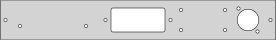
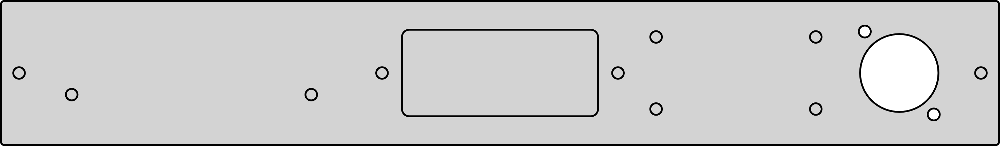
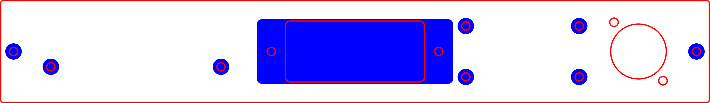

# stack-svg

Simple command line tool for stacking SVGs. Importing SVGs into inkscape uses a bounding box and
uses a corner as the reference point. That means that even if the SVG curves lineup then importing into inkscape or illustrator discards the actual reference point you used to design the file with.

stack-svg just imports the different svgs and puts them ontop of each other using the original reference point. The resulting svg can then be cleaned up using your favorite vector file editor.

This is a command line wrapper around [svgutils](https://svgutils.readthedocs.io/en/latest/). To do more checkout their library!

## Usage

```sh
stack_svg -f top.svg -f bottom.svg -o stacked-top-bottom.svg
```

### top.svg


### bottom.svg


### stacked-top-bottom.svg
The generated files are centered at 0,0 and don't have a bounding box which confuses image display
but plays better as a CAD format.




This can be used for different laser cutter settings after some edits:


